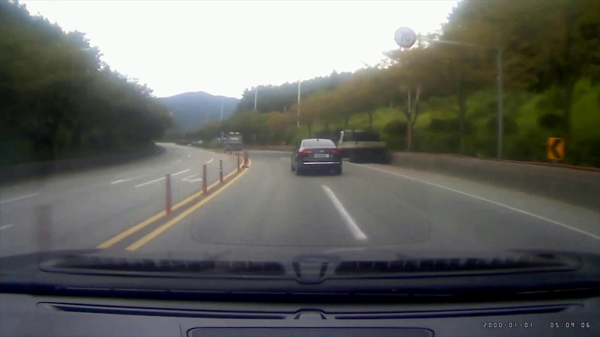
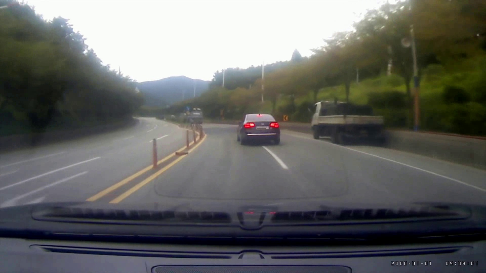

# 자동 속도 및 궤적 산출 결과 보고서

## 1. 분석 내용

### - 사고영상(20230704.mp4)은 1초당 약 30개의 프레임으로 구성.

### - 속도 분석을 위한 자료
|    |    |
| --- | --- |
| t3 | t4 |
|  |  |

| 구간 | 이동거리 | 소요시간 | 속도 |
| --- | --- | --- | --- |
| t3 -> t4 | 50m | 1sec | 50km/h |

## 2. 분석 결과
### - 사고 영상의정보와 현장에서 실측한 사고차량의 이동거리를 근거로 도로교통공단에서 개발한 자동속도 및 궤적 산출 결과 프로그램을 이용하여 사고 차량의 속도를 분석한 결과, 사고당시 사고차량의 속도는 위와 같음.
